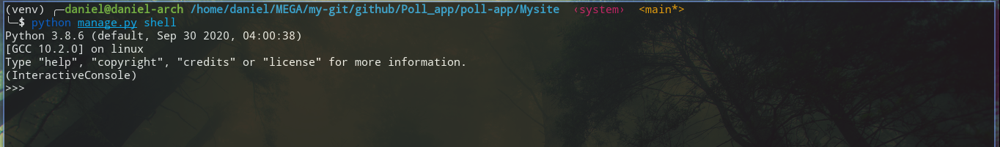
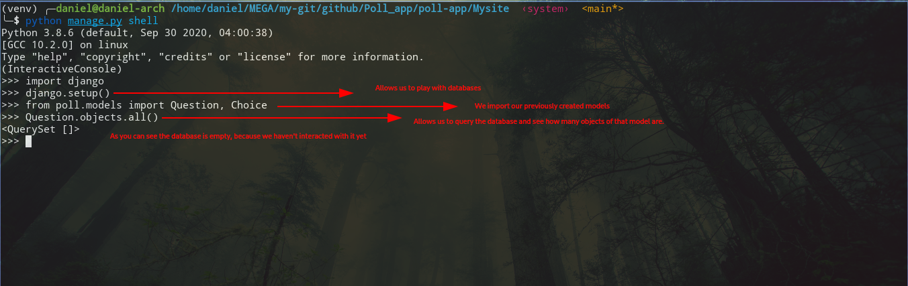
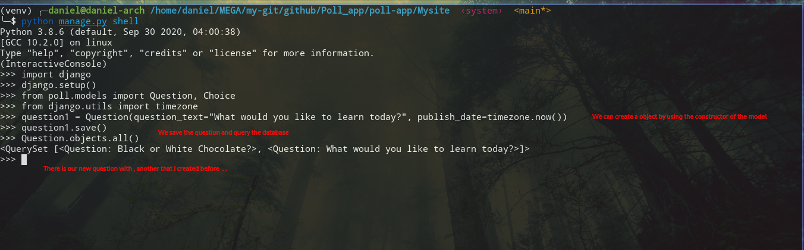
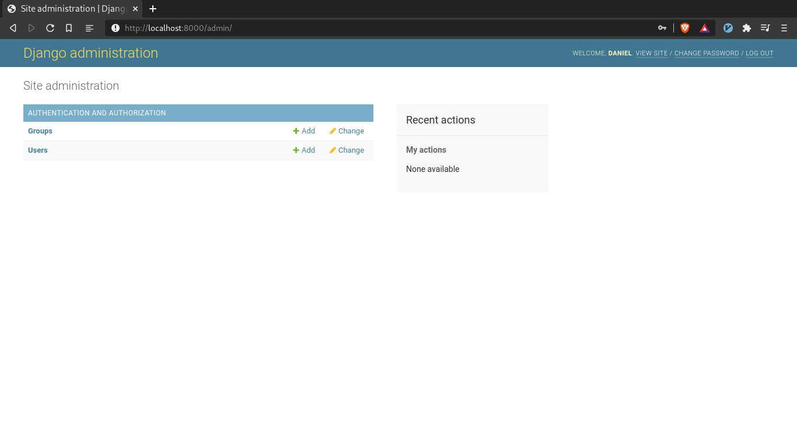
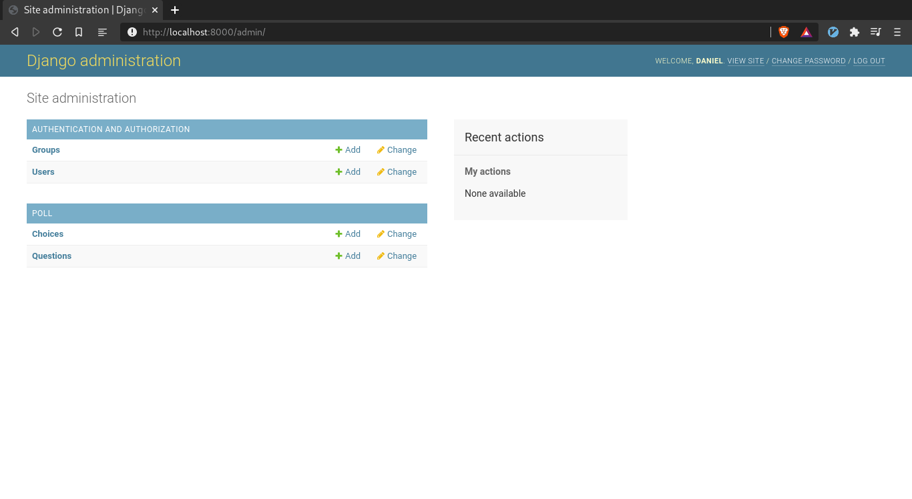
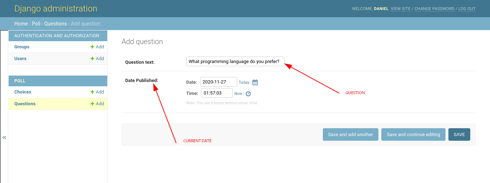
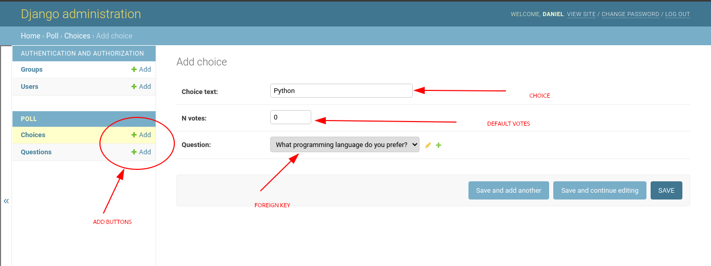

# Ways of interact with databases

There are several ways to interact with databases. The most common are Django shell and Django admin.


# Django shell
Django shell allows us to manage the databases of our site from an interactive python shell.

To enter in the Django shell, type the following command in the project root directory.

```
python manage.py shell 
```

You should have a python shell like this:



Now let's import Django, do a set up to be able to play with database values, import the models we have created, finally let's populate our databases .



So the basics steps to work on Django shell are:

* Import Django
* setup django "django.setup()"
* import our models "from APP.models import 'desired models'"
* Start to populate the databases:
* Useful commands:
    
    *   ```
        Question.objects.all()
        ```
    
To create an object of one of the models, just use it's constructor, for example in my Question model:




For more information about querying go to [this](https://docs.djangoproject.com/en/3.1/topics/db/queries/) article from Django Documentation.


# Django admin

In order to use Django admin you have to create a superuser to work on.

So go to the root directory of the project and type:

```
python manage.py createsuperuser
```

This will let you a prompt, that will ask to you for a username, an email and a superstrong password.

To access to the admin page in our site, first run the server, go to **localhost:8000/admin** and then type the credentials you just created.

```
python manage.py runserver 
```
After entering the credentials you should have something like this.




But wait a moment, as you notice you don't have access yet to Question and Choice models, what do we need to do?

Well you just have to register your models in **app_name/admin.py**. To register our models we need to import them and then register them with **admin.site.register**.

```python

from django.contrib import admin

# Register your models here.

from .models import Question, Choice

admin.site.register(Question)
admin.site.register(Choice)
```

Voila! Now refresh the admin page and you should have the Questions and Choice panels enabled.



Personally I prefer Django admin over Django shell, because I think it is more straight forward, but you can choose whatever you want!

So finally let's populate our databases through Django admin. Let's create as a test, a Question and a linked choice.



