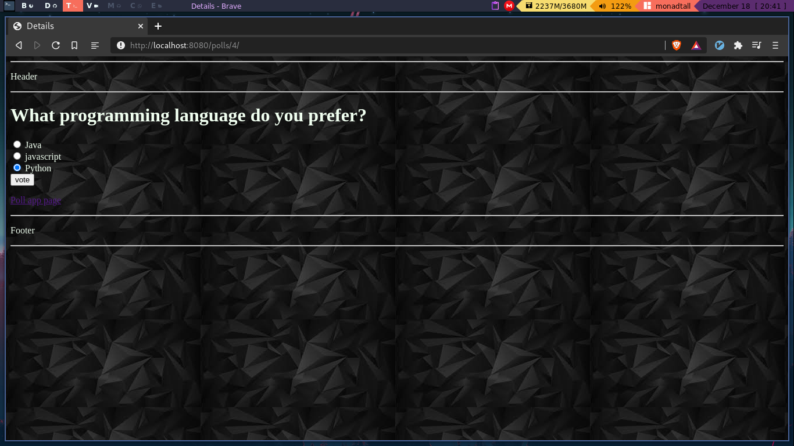

# Static files in Django

Now that you've completed the logic of our app, may is time to make it look better.
For this Django has a structure that allows us, to add styles rapidly.

Let's take a look at that structure:

```bash
├── admin.py
├── apps.py
├── __init__.py
├── migrations
├── models.py
├── __pycache__
├── static
│   └── poll
│       ├── images
│       │   └── background-black.jpeg
│       └── styles.css
├── templates
│   └── poll
│       ├── base.html
│       ├── detail.html
│       ├── footer.html
│       ├── home.html
│       ├── index.html
│       └── results.html
├── tests.py
├── urls.py
└── views.py
```

As you see we have our django.html files located in out templates folder, 
but the static files, and with this I refer to css,
and javascript, are located in a folder named **"static"**, very original name, though.

There you locate the css stuff, that make your app looks
sexy.

Let's add some appeal to our app, just by writing some basic css and a background image.

Download  a random background image from Internet, into a folder located in `poll/static/images` and link it 
into the styles.css file.

`styles.css`

```css
li a {
    color: darkcyan;
    font-size: 20px;
}

body {
    color: honeydew;
    background-image: url("images/background-black.jpeg");
}
```

We haven't apply any changes to our app, so let's link the css to our app.

We use the `` tag to load all statics files in the app, then we need to link the `styles.css`
file in the base.html. 

Remember that the base.html is the father of all the templates we have wrote, so it will apply to all the app.

`base.html`

```html

<!-- The head of our base.html file -->
<head>
    <meta charset="UTF-8">
    <link rel="stylesheet" type="text/css" href="">
    
    
</head>

```

That's all now you should have something like this:



I'm not a master front end developer, so don't expect a nice look and fell in the app.

