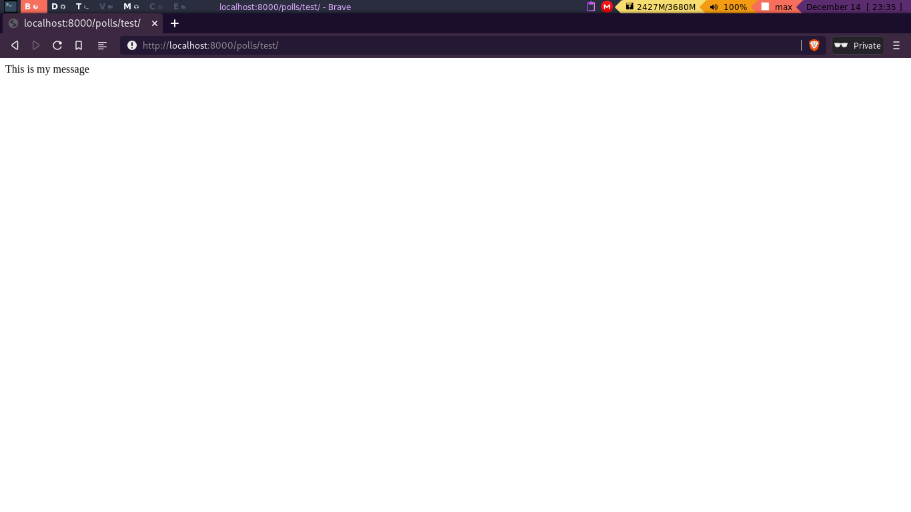

# Views in Django

Basically a view is the part of the code that can interact directly with the user.
When we call a view in Django, it takes a request and returns a response, that is usually
**html** code.

To dive dipper in this topic, review the 
[official documentation](https://docs.djangoproject.com/en/3.1/topics/class-based-views/).

There are two ways to create views in Django, Class based views, and Function based views.
Class based views or CBV's are really useful in large project, but since a poll app is
a simple project, we should use FBV's.

To create a View, we create a function in the **My_app/views.py** file. The function
will return a HttpResponse or will render a template of static files (html, css and JS).

For example to return a simple test message, we create a view function and return a Httpresponse
like :"This is my message!"

```python

from django.http import HttpResponse

def test(request):
	message = "This is my message"
	return HttpResponse(message)
```

Once we've created the view, we need to locate it to a url, for that you can refer to
**My_app/urls.py**, that you have created and locate another url called "test".
```python

from django.urls import path
from . import views


urlpatterns = [
    # Url: localhost:8000/polls/
    path('', views.index, name="index"),
    path("test/", views.test, name="test")
    ]
```

You should have something like this:

