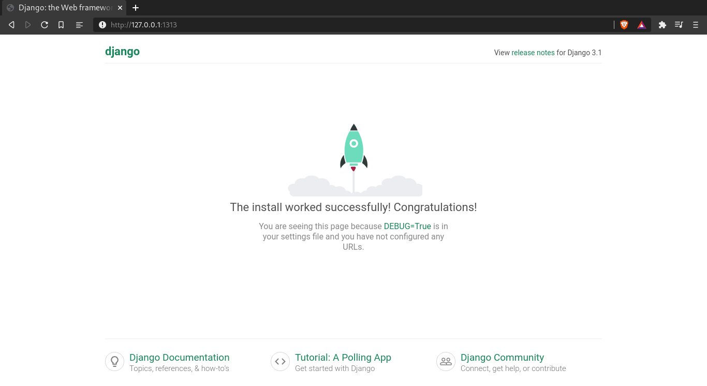

# Django Tutorial

## About
Django is an open-source python framework for Web Development.

This is my version of the poll app available in 
[Django Documentation](https://docs.djangoproject.com/en/3.1/intro/tutorial01/).


## Getting started

You need the Django framework, and a virtual environment to work on.

### Install virtualenv
If you don't have pip installed yet install it from [here](https://packaging.python.org/guides/installing-using-linux-tools/#installing-pip-setuptools-wheel-with-linux-package-managers)

To install the virtualenv package paste the following command

```
pip3 install virtualenv
```
In order to create the virtualenv in your project:

```
virtualenv venv
```
This will create a virtual environment in a folder called venv.

To activate the venv use the following command:

```
source venv/bin/activate
```
If you use different shells like fish (In my case):

```
source venv/bin/activate.fish
```
Now install Django, you should install the Django version I used in [requirements.txt](https://github.com/Daniel1404/Poll-app/blob/main/requirements.txt).

```
pip3 install -r requirements.txt
```

To start a project do:

```
django-admin startproject "NAME OF PROJECT"
```

To start an app use:

```
django-admin startapp poll
```
To check if everything is correctly installed, run in the shell the following command:

```
python3 manage.py runserver 
```
By default Django uses the port 8000, but you can specify the port you want after runserver, let's run django in the port 1313

```
python3 manage.py runserver 1313 
```

Now, type in the bar of your browser **localhost:1313**, or **http://127.0.0.1:1313** (localhost: and 127.0.0.1 are equivalent). 

You should have something like this:



## Structure

This is a quick explanation of the folder structure that implements the Django web framework.
### Tree of the project

```
├── manage.py
├── Mysite
│   ├── asgi.py
│   ├── __init__.py
│   ├── settings.py
│   ├── urls.py
│   └── wsgi.py
└── poll
    ├── admin.py
    ├── apps.py
    ├── __init__.py
    ├── migrations
    │   ├── __init__.py
    ├── models.py
    ├── tests.py
    └── views.py
```


### Files in the project folder:

    * Manage.py:
        * Module that allows us to work with Django through the terminal
        * Used to start a server:
        ~~~
        python3 manage.py runserver "PORT"
        ~~~
        * To make migrations
        
    * "__init__.py":
        * indicates python that the current folder should be 
          treated as a package
    * settings.py:
        *  All the settings for our Website    
    * urls.py:
        * Manage the urls in our website. It's a key file
    * wsgi.py:
        * used to deploy to a server
    * asgi.py
        * used to deploy to a server with ASGI, the emerging Python standard for asynchronous web servers and applications.
        
* The site could have any amount of apps:

    * You can add and remove to your website bit also reuse those apps
    in others websites
    
* To create an app type in the terminal:
~~~
    python3 manage.py startapp "APPNAME"
~~~

### Files in app directory:
    * admin.py:
        * Allows us to add stuff to the administration page
    * apps.py:
        * Used to configure our app 
    * models.py:
        * Used to manage the data in our app
    * test.py:
        * Used to make test
    * views.py:
        * Display any content from a database to the webpage


I strongly encourage you to review [**NOTES_files**](https://github.com/Daniel1404/Poll-app/blob/main/NOTES_files) folder, since it has quick explanations, about the basics of Django.

